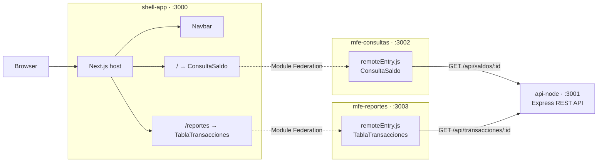

# shell-app

<p>
  
  
  
  
</p>

Host application of the micro-frontend architecture, built with Next.js 14 and
`@module-federation/nextjs-mf`. It loads the `consultas` and `reportes` remotes
at runtime.

> Part of the [**Micro-Frontends on Azure AKS**](https://github.com/Rxcxrdx/microfrontends-aks-jenkins)
> project — see that repository for the full architecture and deployment guide.

## Architecture



Each page wraps its remote in a `RemoteErrorBoundary`, so a micro-frontend that
fails to load shows a friendly message instead of breaking the page.

## Running locally

```bash
npm install
CONSULTAS_URL=http://localhost:3002 REPORTES_URL=http://localhost:3003 npm run dev
```

Requires [`mfe-consultas`](https://github.com/Rxcxrdx/mfe-consultas) on port
`3002` and [`mfe-reportes`](https://github.com/Rxcxrdx/mfe-reportes) on port
`3003`, both serving their `remoteEntry.js`.

Open http://localhost:3000 — `/` renders `ConsultaSaldo` and `/reportes`
renders `TablaTransacciones`.

## Production build

```bash
CONSULTAS_URL=<consultas-url> REPORTES_URL=<reportes-url> npm run build
npm start
```

## Docker

```bash
docker build \
  --build-arg CONSULTAS_URL=http://localhost:3002 \
  --build-arg REPORTES_URL=http://localhost:3003 \
  -t shell-app .
docker run -p 3000:3000 shell-app
```

Uses the Next.js `standalone` output. The container runs as a non-root user and
exposes port `3000`.

> **Remote URLs are resolved at build time**, not at runtime — `next.config.js`
> inlines them into the bundle. The browser fetches each `remoteEntry.js`
> directly, so these must be URLs the **browser** can reach: a public ingress
> address, never an internal Kubernetes service name. Setting them as
> environment variables on a Kubernetes deployment has no effect; they must be
> passed as `--build-arg` values.
