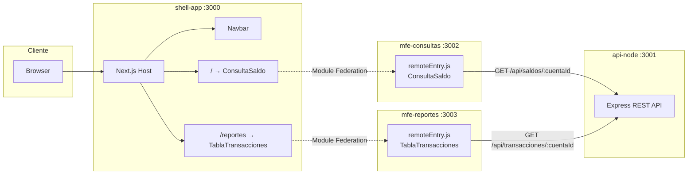

# shell-app

Shell (host) de la arquitectura de micro-frontends, construido con Next.js 14 y `@module-federation/nextjs-mf`. Consume en runtime los remotes `consultas` (`ConsultaSaldo`) y `reportes` (`TablaTransacciones`).

## Arquitectura



- Las URLs de los remotes se resuelven vía las variables de entorno `CONSULTAS_URL` y `REPORTES_URL` (usadas en `next.config.js` al hacer build), lo que permite apuntar a los `Service` de Kubernetes de cada micro-frontend en cada ambiente.
- Cada página envuelve su remote en un `RemoteErrorBoundary` que muestra un mensaje amigable si el micro-frontend correspondiente no carga (caído, no accesible, etc).

## Correr local

```bash
npm install
CONSULTAS_URL=http://localhost:3002 REPORTES_URL=http://localhost:3003 npm run dev
```

Requiere que `mfe-consultas` (puerto 3002) y `mfe-reportes` (puerto 3003) estén corriendo, sirviendo su `remoteEntry.js`.

Abre `http://localhost:3000`:
- `/` muestra `ConsultaSaldo`.
- `/reportes` muestra `TablaTransacciones`.

## Build de producción

```bash
CONSULTAS_URL=http://consultas-service:3002 REPORTES_URL=http://reportes-service:3003 npm run build
npm start
```

Las URLs de los remotes quedan resueltas en el bundle generado por ese build, por lo que en Kubernetes conviene generar/parametrizar la imagen por ambiente con las URLs correctas de cada `Service`.

## Docker

```bash
docker build \
  --build-arg CONSULTAS_URL=http://localhost:3002 \
  --build-arg REPORTES_URL=http://localhost:3003 \
  -t shell-app .
docker run -p 3000:3000 shell-app
```

Usa el output `standalone` de Next.js; el contenedor corre como usuario no-root y expone el puerto `3000`.
